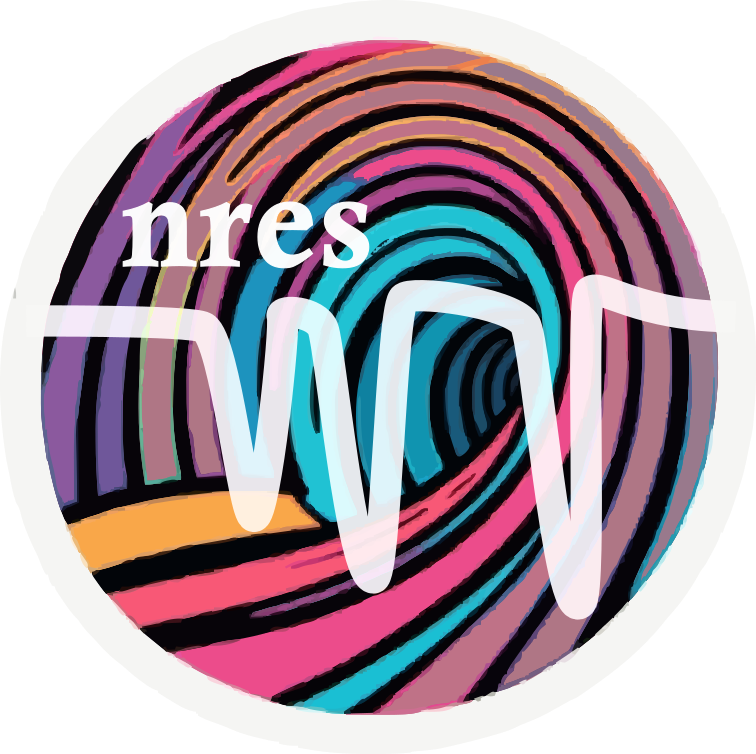
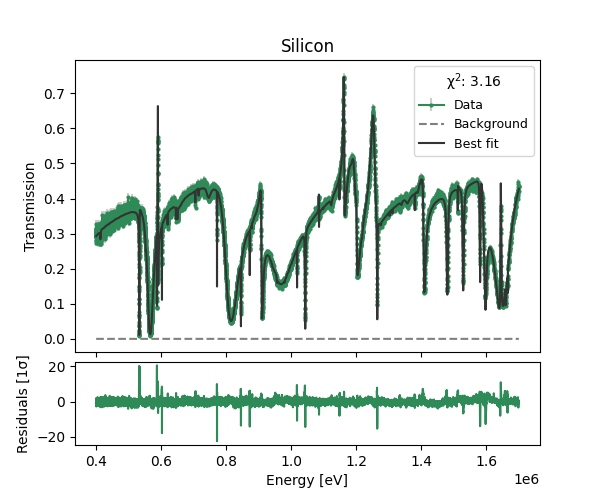

# nres

<p align="center">
  
</p>


[](https://nres.readthedocs.io/en/latest/?badge=latest)
<!-- [![PyPI version][pypi-version]][pypi-link]
[![PyPI platforms][pypi-platforms]][pypi-link] -->


Simple yet powerful package for fitting neutron resonances.

`nres` (pronounced N-res) allows quick and easy quantitative fitting of total cross-section for neutron absorption resonances transmission spectrum in the epithermal and fast energy regions.

## Features

- Flexible and simple way to generate and combine cross-sections from different isotopic materials
- Built-in database of many useful materials and elements
- Cross-sections taken from ENDF8.0
- Built on `lmfit` for intuitive and powerful fit exploration
- Python API leveraging popular libraries like `numpy` and `pandas`
- Methods to define response functions and background functions
- Plotting utilities for concise result visualization
- Fast cross-section integration and convolution with response function using C++ core code

## Installation

From source:
```bash
git clone https://github.com/TsvikiHirsh/nres
cd nres
pip install .
```


## Basic Usage

```python
# Import nres
import nres

# Define material
Si = nres.CrossSection.from_material("Silicon")

# Load data
data = nres.Data.from_transmission("silicon.dat") 

# Define model
model = nres.TransmissionModel(Si, vary_background=True)

# Fit using lmfit
result = model.fit(data, emin=0.4e6, emax=1.7e6) 

# Plot fit results
result.plot()
```


## Usage

For more detailed examples and advanced usage, please refer to our Jupyter [notebook demo](notebooks/nres_demo.ipynb) or to our [documentation page](https://nres.readthedocs.io).

## Contributing

See [CONTRIBUTING.md](CONTRIBUTING.md) for instructions on how to contribute.

## License

Distributed under the terms of the [MIT license](LICENSE).

## Contact

For questions, issues, or contributions, please visit the [GitHub repository](https://github.com/tsvikihirsh/nres).


<!-- prettier-ignore-start -->
[actions-badge]:            https://github.com/TsvikiHirsh/nres/workflows/CI/badge.svg
[actions-link]:             https://github.com/TsvikiHirsh/nres/actions
<!-- [pypi-link]:                https://pypi.org/project/nres/
[pypi-platforms]:           https://img.shields.io/pypi/pyversions/nres
[pypi-version]:             https://img.shields.io/pypi/v/nres -->
<!-- prettier-ignore-end -->
